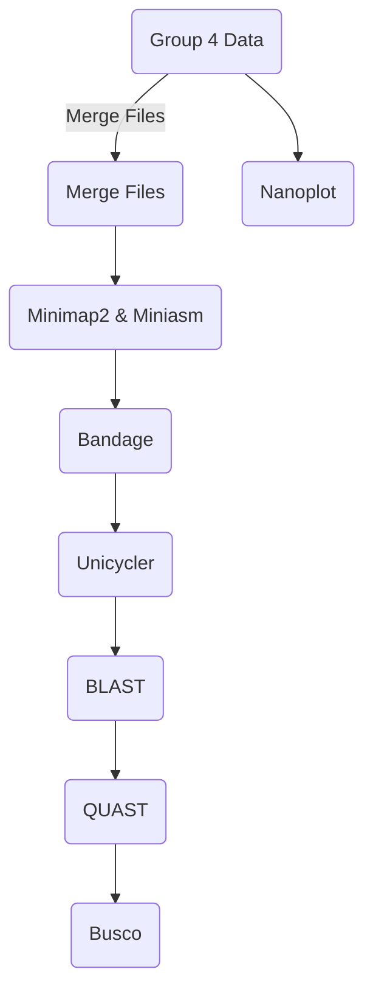

# Genome Assembly using Illumina and Nanopore data

This project utilises both long-read (nanopore) data and short-read (illumina) data to conduct genome assembly. The pipeline conists of the quality control tool NanoPlot to assess the Nanopore reads. Also, the use of Minimap2 and Miniasm to align and assemble the reads, as well as the use of Bandage to visualise the assembled genome. Furthermore, the genome assembly tool Unicycler is utilised alongside Quast which is a quality assessment tool for genome assemblies and Busco which assesses genome assembly and annotation completeness. Finally, the gene annotation tool Prokka and the genome visualiser software GenoVi are used.

## Our Data
### The Short-Read Data:
Example name: *H3932_S4_L001_R1_001_fastqc.zip* and *H3932_S4_L001_R2_001_fastq.gz*

* H3932_S4 = Sample name
* L00* is the lane number i.e. 4 lanes were used
* R1 means it is a forward strand
* R2 means it is a reverse strand
* 001 = The file number
* .fastq.gz files are compressed FastQ files containing raw sequencing data
* fastqc.zip files are compressed archives containing the output files generated by FastQC

#### Our short-reads dataset contains 4 different reads, both with a forward and reverse strand 


### The Long-Read Data:
Example name: *FAQ09231_pass_barcode04_a6a5014a_0.fastq.gz* and fail one

* FAQ09231 = Sample name
* Pass = 
* Fail =
* Barcode is the
* a6a5014a is the
* 0 is the


## Figures
### NanoPlot Figure:

 


The example plot above shows a KDE plot (Kernel Density Estimation) for Nanopore long read data, comparing read length with average read quality.

In addition to various plots, NanoPlot also creates a NanoPlot report which can be viewed by creating a web browser:

`python3 -m http.server 34567` - 34567 is an example of the personalised 5 digit extension that is required 

To view the report go to your web browser and type:

http://<ip address>:34567  - which is the ip and your personalised the hpc extension


### Miniasm Figure:
The following example image illustrates a GFA file produced by Miniasm (visualised using Bandage) following Minimap2 assembly of short read data.


### Unicycler Figure:
The example image below illustrates a GFA file produced by Unicycler which has been visualised using Bandage. Unicycler is specifically designed for the assembly of bacterial genomes. Both short and long reads as well as combined (hybrid) reads can be employed by Unicycler


### Quast Figure:
The example image below is an output file produced via QUAST analysis comparing all long read, pass only long read, short read, and hybrid unicycler output.


### GenoVi Figure:


## Installation

### Nanoplot
Nanoplot can be installed using pip:

`pip install NanoPlot`

You may need to upgrade the pip version:

`pip install --upgrade pip`

For further detail about NanoPlot, refer to the NanoPlot GitHub Repository: https://github.com/wdecoster/NanoPlot.git

#### Example Usage:
```
NanoPlot -t 8 --fastq FAQ09231_pass_barcode04_a6a5014a_0.fastq.gz --plots kde

```

### Minimap2
Minimap can be installed using conda:

`conda install bioconda::minimap2`

For further detail about Minimap2, refer to the Minimap2 GitHub Repository: https://github.com/lh3/minimap2.git

#### Example Usage:

```
minimap2 -t 8 -x ava-ont all_lr.fastq.gz all_lr.fastq.gz | gzip -1 > minimap_all_lr.paf.gz

```

### Unicycler
The most up to date version of Unicycler can be installed by:

`git clone https://github.com/rrwick/Unicycler.git`

`cd Unicycler`

`python3 setup.py install`

For further detail about Unicycler, refer to the Uncycler GitHub Repository: https://github.com/rrwick/Unicycler.git

#### Example Usage:

Long Read Assembly:

```
unicycler \
-t 8 \
-l longreads_pass_allfiles.fastq.gz \
-o lr_pass_output2

```

Short Read Assembly:

```
unicycler \
--kmers 25,55,71 \
-t 8 \
-1 R1_short_reads_allfiles.fastq.gz \
-2 R2_short_reads_allfiles.fastq.gz \
-o unicycler_sr_out

```

Hybrid Assembly:

```
unicycler \
--kmers 25,55,71 \
-t 8 \
-l all_longreads/longreads_pass_allfiles.fastq.gz \
-1 shortreads/R1_short_reads_allfiles.fastq.gz \
-2 shortreads/R2_short_reads_allfiles.fastq.gz \
-o hybrid_uc_out4

```


### Bandage
Bandage can be installed using HomeBrew for OS or by downloading the binaries for other platforms, which can be found from the Bandage website (https://rrwick.github.io/Bandage/) or the Bandage GitHub Release Page (https://github.com/rrwick/Bandage/releases/). 

For installation on OS using HomeBrew:

`brew install bandage`

For further detail about Bandage, refer to the Bandage GitHub Repository: https://github.com/rrwick/Bandage.git

Also, to install brew on Mac:

`/bin/bash -c "$(curl -fsSL https://raw.githubusercontent.com/Homebrew/install/HEAD/install.sh)" `

Then in order to allow Bandage to see the BLAST install on M1 Mac, a symbolic link must be creatde to your BLAST install:

```
sudo ln -s /opt/homebrew/bin/makeblastdb /usr/local/bin/makeblastdb
sudo ln -s /opt/homebrew/bin/blastn /usr/local/bin/blastn
sudo ln -s /opt/homebrew/bin/tblastn /usr/local/bin/tblastn

```


### Quast
QUAST can be installed using Python with a basic installation as well as a full installation:

Basic installation:

`./setup.py install`

Full installation:

`./setup.py install_full`

For further detail about QUAST, refer to the QUAST GitHub Repository: https://github.com/ablab/quast.git

For this project, QUAST was installed using a virtual environment on Python:

```
# Create virtual environment:
python3 -m venv myenv (only need to create once)

# Activate:
source myenv/bin/activate

# Install quast:
pip3 install quast

# If an update is required:
pip3 install --upgrade quast

```

#### Example Usage:

```
python /shared/conda/shared/bin/quast all_longreads/lr_pass_output2/lr_pass.fasta \
shortreads/unicycler_sr_out/sr_uc_assembly.fasta \
all_longreads/all_unicycler_output/lr_uc_assembly.fasta \
hybrid_uc_out/h_uc_assembly.fasta \
-r matt_data/barcode09/uc_b9_out/hv/hv_fullwplas.fasta \
-g matt_data/barcode09/uc_b9_out/hv/hv_fullwplas.gff3 \
-o qst_all_og_out

```


### Busco

For this project, Busco was installed via the conda environment:

`/shared/conda/busco`

The lineage dataset is accessed via:

`/shared/conda/busco_downloads/lineages/archaea_odb10` 

Specifying the archaea_odb10 with the -l flag `-l archaea_odb10`

For further detail about Busco, refer to the Busco GitHub Repository: https://github.com/WenchaoLin/BUSCO-Mod.git


#### Example Usage:

```
busco \
-i /workhere/students_2023/group4/shortreads/unicycler_sr_out/sr_uc_assembly.fasta \
-l /shared/conda/busco_downloads/lineages/archaea_odb10 \
-o /workhere/students_2023/group4/busco \
-m genome 

```


### Prokka
Version prokka 1.14.6

Prokka can be installed using Bioconda:

`conda install -c conda-forge -c bioconda -c defaults prokka`

For further details about Prokka, refer to the Prokka GitHub Repository: https://github.com/tseemann/prokka.git

#### Example Usage:

```
prokka \
--outdir /workhere/students_2023/group4/matt_data/barcode04/uc_4_out/prokka_4_out \
--prefix barcode04 \
--kingdom Archaea \
--gcode 1 \
--cpus 8 \
./barcode04/uc_4_out/barcode04.fasta

```

### GenoVi

The GenoVi dependencies can be installed using bioconda:

`conda create -n genovi python=3.7 circos`

The next step is to activate the environment:

`conda activate genovi`

Then install GenoVi using pip:

`pip install genovi`

For further detail regarding GenoVi, refer to the GenoVi GitHub Repository: https://github.com/robotoD/GenoVi.git

#### Example Usage:

```
```


## Pipeline for Group 4 data genome assembly:



## Additional Resources
For more detailed explanations about each step of the process, refer to the following YouTube videos :

- [NanoPlot Tutorial] (https://www.youtube.com/watch?v=AeJj7_MMBTo): This video demonstrates how to use NanoPlot for quality control
- [Minimap2 Tutorial] (https://www.youtube.com/watch?v=f4sT5pEHoxU): This video explains the use of Minimap2 for mapping and Miniasm for genome assembly
- [Unicycler Tutorial] (https://www.youtube.com/watch?v=oTCLahU31Lg): This video demostrates the use of Unicycler for hybrid genome assembly
- [Bandage Tutorial]  (https://www.youtube.com/watch?v=avorVt8PxiY): This video shows how to install Bandage for Linux and usage for genome assembly visualisation 


## Contributions
If you found an issue or would like to submit an improvement to this project, please open an issue or submit a pull request.


## Acknowledgments
- Nanoplot: NanoPlot GitHub Repository: https://github.com/wdecoster/NanoPlot.git
- Minimap2: Minimap2 GitHub Repository: https://github.com/lh3/minimap2.git
- Unicycler: Unicycler GitHub Repository: https://github.com/rrwick/Unicycler.git
- Bandage : Bandage GitHub Repository: https://github.com/rrwick/Bandage.git and Bandage Website: https://rrwick.github.io/Bandage/
- QUAST: QUAST GitHub Repository: https://github.com/ablab/quast.git
- Busco: Busco GutHub Repository: https://github.com/WenchaoLin/BUSCO-Mod.git
- Prokka: Prokka GitHub Repository: https://github.com/tseemann/prokka.git
- GenoVi: GenoVi GitHub Repository: https://github.com/robotoD/GenoVi.git
